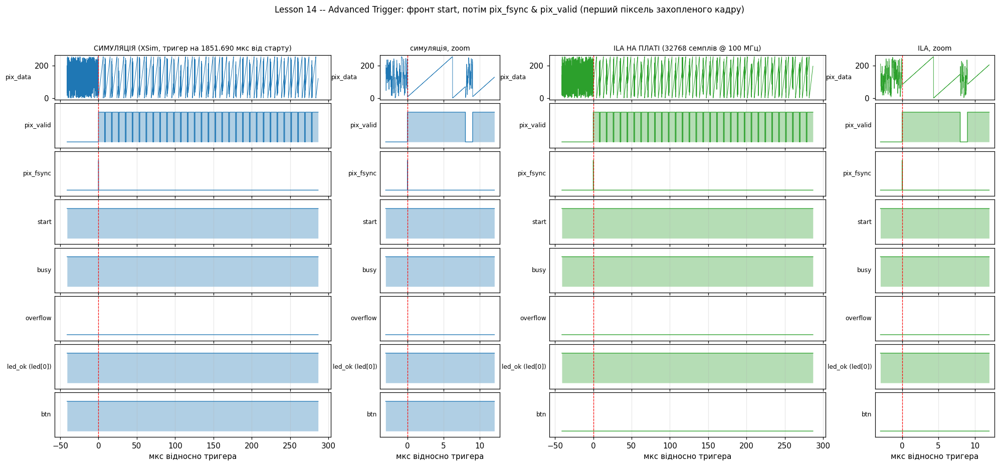
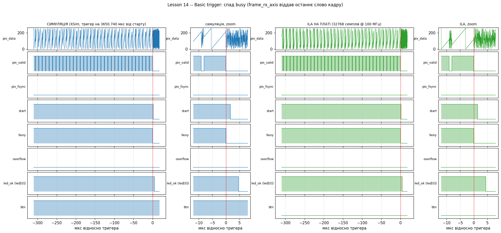

# Lesson 14 — ILA на системі кадр → AXI DMA → RAM (варіант А)

Домашнє завдання до лекції 14 (`FPGA/lesson_14/Zanyattya14_dz.md`), **варіант А — є робоче залізо**.
Плата: MicroPhase Z7-Lite-ES1 (xc7z010clg400-1), Vivado 2026.1, JTAG — FT232H.

За основу взято готовий проєкт [lesson12](../lesson12) (MicroBlaze, кадр 320x200 через AXI DMA S2MM в `axi4_full_ram`).
Логіка BD і програма (ELF lesson12) — без змін. Додано:

* `rtl/pix_pattern_gen.v` — синтезоване джерело кадрів на 40 МГц (копія моделі камери з `lesson12/tb`),
  бо камери на JP1 немає. Піксель = `(x + 2y + 7·frame) & 0xFF`, у бланкінгу — сміття LFSR.
  Генератор працює вільно, як справжня камера, і нікого не чекає;
* `rtl/top.v` — `design_1_wrapper` + генератор + **ILA, вставлена вручну (HDL Instantiation)**
  з IP Catalog: 5 проб, тобто працює і в тарифі Basic, без `mark_debug` / Set up Debug.

## 1. ILA — 5 проб, такт `aclk` = 100 МГц

| Проба | Ширина | Сигнал | Навіщо |
|---|---|---|---|
| probe0 | 8 | `pix_data` | пікселі (домен 40 МГц, ILA семплює на 100 МГц) |
| probe1 | 1 | `pix_valid` | рядки / бланкінг |
| probe2 | 1 | `pix_fsync` | перший піксель кадру |
| probe3 | 1 | `dbg_start` | AXI GPIO 0 ch2: MicroBlaze дозволяє приймачу взяти кадр |
| probe4 | 4 | `{led[0], overflow, busy, btn}` | стан `frame_rx_axis`, кнопка, результат програми |

`ila_0`: глибина 32768 (327 мкс), **Advanced Trigger (TSM) увімкнено**, Capture Control (`C_EN_STRG_QUAL`) увімкнено,
2 компаратори на пробу. Ресурси ILA: 2679 LUT, 3899 FF, 15 BRAM36. Уся система: 9838 LUT (56 %), 48/60 BRAM.
Timing: **WNS +0.962 нс, WHS +0.010 нс** — все сходиться.

> Конкатенацію в probe4 `.ltx` розбирає назад на нети: у Hardware Manager видно `btn_IBUF`, `dbg_status[1:0]`,
> `led_OBUF`, а не одну 4-бітну пробу. Тригер на `busy` ставиться на `dbg_status[0]`.

## 2. Тригери — події, що бувають раз на натискання KEY2

Кадри йдуть безперервно (кадр 1.85 мс, ~540 кадрів/с), тож "pix_fsync = 1" спрацює будь-коли. Потрібна подія,
що трапляється **рівно раз**:

**start — Advanced Trigger (двостанова TSM, `hw/ila_frame_start.tsm`):**
спочатку фронт `start` (MicroBlaze побачив натискання і запустив DMA), **потім** перший `pix_fsync & pix_valid`,
тобто перший піксель саме того кадру, що піде в RAM. Позиція тригера 4096 (видно 41 мкс до нього).

```
state wait_start:
    if (dbg_start == 1'bR) then goto wait_fsync; else goto wait_start; endif
state wait_fsync:
    if ((pix_fsync == 1'b1) && (pix_valid == 1'b1)) then trigger; else goto wait_fsync; endif
```

**end — Basic trigger:** спад `busy` (`dbg_status[0] == F`) — `frame_rx_axis` віддав останнє слово кадру.
Позиція тригера 31000: видно останні 310 мкс кадру і що відбувається одразу після.

## 3. Результат на платі (2026-10-07)

| Що | Результат |
|---|---|
| start | спрацював, `core status: FULL`, `hw/captures/start.ila` |
| end | спрацював, `core status: FULL`, `hw/captures/end.ila` |
| кадр у RAM (`hw/verify_ram.tcl`) | **16000 / 16000 слів збігаються з формулою**, кадр f = 24 (mod 256) |
| DMA після кадру | `DMASR = 0x2` (idle), `LENGTH = 0xFA00` = 64000 |
| LED | `led[0]` світить (active-low) — програма перевірила кадр і показала OK |

Файли `.ila` відкриваються у Vivado: `read_hw_ila_data hw/captures/start.ila; display_hw_ila_data`.

## 4. Порівняння ILA ↔ симуляція того самого проєкту

Симуляція — системна Behavioral (XSim) того самого `top` з ELF lesson12 у LMB (`vivado/sim.tcl`, ILA вимкнена
через `NO_ILA`, ті самі 5 сигналів пишуться у VCD з `tb_top`). Обидва графіки будує `docs/plot_waves.py`
однаково: семпли по фронту `aclk`, час відносно тригера, той самий тригер і те саме вікно, що в ILA.

### start


### end


**Збігається:**
* структура кадру: рядок 320 пікселів = 8 мкс `pix_valid`, бланкінг 1 мкс, лінійна рампа `pix_data` у рядку,
  сміття LFSR у бланкінгу;
* `pix_fsync` — один такт разом із першим пікселем, рівно в точці тригера;
* `busy` піднятий увесь кадр, `overflow = 0` (FIFO pix_clk → aclk не переповнюється);
* після кінця кадру — та сама послідовність і ті самі затримки, що задає програма MicroBlaze:
  `start` падає через **1.39 мкс** після спаду `busy`, `led[0]` вмикається через **4.40 мкс** (сим. і плата).

**Відрізняється (і так має бути):**
* **номер кадру.** Генератор працює вільно, як камера, тому значення пікселів різні:
  у симуляції перший піксель 0x07 (f = 1), на платі 0x53 (f = 85). Номер видно з `7f ≡ pix mod 256`;
* **`btn`.** Testbench відпускає кнопку через 20 мкс після підйому `busy`, ще до першого пікселя, тому у вікні `btn = 1`.
  Людське натискання триває сотні мс ≫ кадр 1.8 мс, тому на платі `btn = 0` у всьому вікні;
* **фаза кадру.** У симуляції тригер на 1.85 мс від початку (після reset і старту програми); на платі перший кадр
  приходить у випадковій фазі відносно натискання — від 0 до одного періоду кадру.

## 5. Як відтворити

```bash
cd vivado
vivado -mode batch -source create_project.tcl     # проєкт + ila_0 + BD
vivado -mode batch -source sim.tcl                 # симуляція → docs/sim_probes.vcd
vivado -mode batch -source impl.tcl                # synth + impl + top.bit + top.ltx

cd ../hw
xsdb hold_ps.tcl &                                 # тримати ARM зупиненими (див. нижче)
vivado -mode batch -source program.tcl
vivado -mode batch -source ila_capture.tcl -tclargs start 30   # 30 хв чекати; натиснути KEY2
vivado -mode batch -source ila_capture.tcl -tclargs end 30     # ще раз KEY2
xsdb verify_ram.tcl

cd ..
python3 docs/plot_waves.py docs/sim_probes.vcd hw/captures/start.csv start docs/wave_start.png
python3 docs/plot_waves.py docs/sim_probes.vcd hw/captures/end.csv   end   docs/wave_end.png
```

## Підводні камені

* **Плата вантажиться з SD**, і програма на ARM через кілька секунд перепрошиває PL — ILA і MicroBlaze зникають.
  `hw/hold_ps.tcl` зупиняє обидва Cortex-A9 і тримає їх, поки працює. Альтернатива — перемкнути boot на JTAG.
* **Убитий OOC-ран IP** (у мене `ila_0_synth_1` вбив OOM) лишає маркер `__synthesis_is_running__`,
  і `synth_1` чекає на нього вічно без жодної помилки. `impl.tcl` тепер скидає всі IP-рани не на 100 %.
* `wait_on_hw_ila -timeout` — у **хвилинах**.
