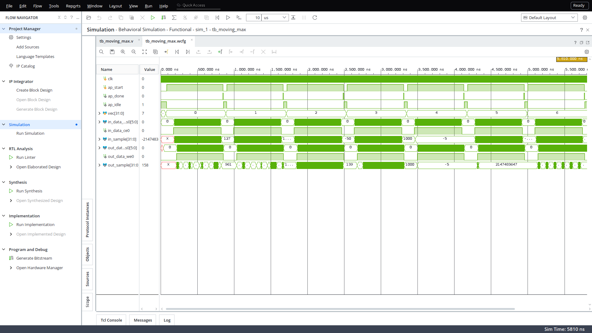
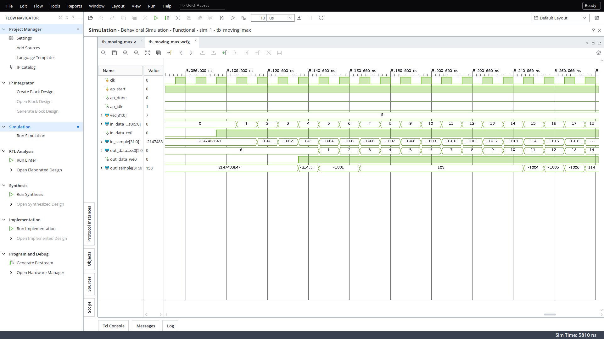

# Lesson 15 — IP ковзного максимуму у Vitis HLS

Домашнє завдання до лекції 15 (`FPGA/lesson_15/Zanyattya15_dz.md`), за заготовкою `FPGA/lesson_15/HW`.
Vitis HLS / Vivado 2026.1, частина xc7z010clg400-1 (Z7-Lite, як у попередніх уроках), такт 10 нс.

`moving_max(int in[64], int out[64])`: `out[n] = max(in[n-7] .. in[n])`, для `n < 7` — максимум з наявних `in[0..n]`.
Масиви фіксованого розміру, без `malloc` і зашитих адрес, кожен `in[n]` читається один раз.

## Файли

| Що | Де |
|---|---|
| функція | `src/moving_max.cpp`, `src/moving_max.h` (заголовок — без змін із заготовки) |
| C++ тестбенч | `src/moving_max_tb.cpp` |
| HLS-компоненти (Vitis Unified) | `hls/nopipe/`, `hls/pipe/` — `hls_config.cfg` + `vitis-comp.json`, звіти, RTL, `moving_max.zip` |
| Verilog-тестбенч | `tb/tb_moving_max.v` |
| Vivado | `vivado/create_project.tcl`, `sim.tcl`, `sim_gui.tcl` |
| скриншоти | `docs/vivado_sim_*.png` (`docs/screenshot.py`) |

## Функція

Заготовку дописано без зміни структури: `window[8]` — регістр зсуву останніх 8 відліків,
`INIT_LOOP` заповнює його `INT_MIN` (тому для `n < 7` "порожні" позиції ніколи не виграють),
у `MAIN_LOOP` — зсув (`SHIFT_LOOP`), єдине читання `in_data[n]` у `window[0]`, пошук максимуму (`MAX_LOOP`).

Обидві версії збираються з **одного** файлу: прагма стоїть під `#ifdef MM_PIPELINE`, а компоненти
відрізняються лише рядком у конфігу:

```
hls/nopipe/hls_config.cfg:  syn.compile.pipeline_loops=0                      # без директив, автоконвеєр вимкнено
hls/pipe/hls_config.cfg:    syn.compile.pipeline_loops=0
                            syn.cflags=-DMM_PIPELINE                          # -> #pragma HLS PIPELINE II=1 у MAIN_LOOP
```

## C++ тестбенч

Еталон — прямий перебір за правилом (`max` по `in[max(0,n-7)..n]`), без вікна і без `INT_MIN`.
7 векторів: випадкові 0..999, випадкові на весь діапазон `int`, зростання, спадання, константа −5,
чергування `INT_MIN`/`INT_MAX`, поодинокі піки на від'ємному фоні з `in[0] = INT_MIN`.
Повертає 0 при успіху, 1 при помилці — перевірено навмисно зламаною версією (вікно 7): `Test FAILED: 92 помилок`, код 1.

## Результати

### C Simulation — обидві версії `Test passed !`

### C Synthesis (оцінка HLS, 10 нс)

| Версія | Latency, тактів | Interval | DSP | FF | LUT | BRAM | Slack |
|---|---|---|---|---|---|---|---|
| **без директив** (`nopipe`) | **2058** | 2059 | 0 | **111** | **322** | 0 | +1.73 нс |
| **`PIPELINE II=1`** (`pipe`) | **79** | 80 | 0 | **576** | **746** | 0 | +0.80 нс |

* **nopipe:** `window` стала маленькою RAM 8×32 з одним портом читання і одним запису (`window_RAM_AUTO_1R1W`), тому кожна ітерація
  `SHIFT_LOOP` і `MAX_LOOP` — 2 такти: 8 (INIT) + 64 × 32 (7×2 зсув + 7×2 максимум + 4) + 2 = 2058.
* **pipe:** `Final II = 1, Depth = 5` — досягнуто однією прагмою: HLS сам повністю розгорнув `SHIFT_LOOP`/`MAX_LOOP`
  і розклав `window` на 8 регістрів (звідси FF), 7 порівнянь працюють паралельно (звідси LUT).
  79 = 8 (INIT_LOOP, не конвеєризований) + 69 (конвеєр MAIN_LOOP: 64 ітерації з II=1 + заповнення) + 2.
* Разом: **у 26 разів менше тактів** ціною ~5× FF і ~2.3× LUT; DSP і BRAM не потрібні жодній версії.

### Co-simulation — обидві `PASS`

| Версія | Latency min/avg/max | Interval min/avg/max |
|---|---|---|
| nopipe | 2058 / 2058 / 2058 | 2059 / 2059 / 2059 |
| pipe | 77 / 77 / 77 | 78 / 78 / 78 |

RTL на 2 такти швидший за оцінку синтезу (77 проти 79).

### Package

`vitis-run --package` → IP Catalog: `hls/<версія>/moving_max/moving_max.zip` (`xilinx.com:hls:moving_max:1.0`).

## Verilog-тестбенч і симуляція у Vivado

`vivado/create_project.tcl` розпаковує `hls/pipe/moving_max/moving_max.zip` в `vivado/ip_repo`, додає IP
`moving_max_0` у звичайний Verilog-проєкт (без Block Design і процесора) і `tb/tb_moving_max.v` як тестбенч.

Тестбенч побудований як `tb_fir_binomial.v` з лекції: дві моделі RAM за `ap_memory` (затримка читання 1 такт),
керування `ap_ctrl_hs`, 7 викликів поспіль з тими самими типами векторів, що в C++, власний еталон-перебір.
Додатково міряє латентність кожного виклику і перевіряє порядок читання `in_data`.

```
vector 0:   ok, latency 77 cycles, in_data reads 64 + 1 speculative, start 80 ns
...
vector 6:   ok, latency 77 cycles, in_data reads 64 + 1 speculative, start 5000 ns
Test passed !
```

Навмисно зламаний еталон (вікно 7) дає `MISMATCH ...` і `Test FAILED: 92 errors` — тестбенч справді ловить помилки.

**"+1 speculative".** На виході з конвеєризованого циклу IP робить ще одне читання `in_data` (адреса 0) і відкидає
результат: у `moving_max_moving_max_Pipeline_MAIN_LOOP.v` `in_data_ce0` залежить лише від активності стадії 0,
а не від умови виходу `n == 64`, і адреса 64 у 6 бітах дає 0. На рівні C кожен відлік читається один раз;
у RTL це звичайне спекулятивне звернення HLS до пам'яті без побічних ефектів. Тестбенч перевіряє, що перші 64
звернення йдуть по адресах 0..63 рівно по разу, а зайве лише рахує.

### Скриншоти симуляції (Vivado, Behavioral Simulation)

Усі 7 викликів: `ap_start` → `ap_done`, читання `in_data` і запис `out_data`, номер вектора `vec`:



Початок вектора 6 (піки на від'ємному фоні): `in[0] = INT_MIN` → `out[0] = −2147483648`, `out[1] = −1001`;
пік `in[3] = 103` тримається у виході рівно 8 відліків (`out[3..10]`), далі `−1004, −1005, −1006`, і новий пік `114`:



## Як відтворити

```bash
V=/path/to/2026.1
cd hls/pipe            # і так само hls/nopipe
$V/Vitis/bin/vitis-run --mode hls --csim    --config hls_config.cfg --work_dir moving_max
$V/Vitis/bin/v++ -c    --mode hls           --config hls_config.cfg --work_dir moving_max
$V/Vitis/bin/vitis-run --mode hls --cosim   --config hls_config.cfg --work_dir moving_max
$V/Vitis/bin/vitis-run --mode hls --package --config hls_config.cfg --work_dir moving_max

cd ../../vivado
vivado -mode batch -source create_project.tcl
vivado -mode batch -source sim.tcl                          # текстовий результат
python3 ../docs/screenshot.py 5070 5170 ../docs/vivado_sim_zoom.png 1065 133   # скриншот на Xvfb :99
```

Компоненти `hls/nopipe` і `hls/pipe` відкриваються і в Vitis Unified IDE (Open Component → каталог з `vitis-comp.json`).
